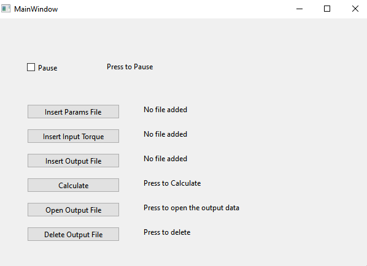

# Control Systems Implementation Project

This repository contains the C++ and Matlab code for the Control Systems Implementation Project completed in July 2023. The project involves the simulation and control of a traction system for an electric vehicle. Key components include wheel thrust force, engine rotation speed, linear speed of the vehicle, vehicle displacement, power consumed by the motor, and current supplied by the battery.

## Features

- **Simulation in C++ with Qt-SDK (console mode):** Simulate the system's behavior with a 5ms delay, representing 1 second for every 200 data points in the input file.

- **Matlab Processing:** Define and implement Matlab scripts to read data from a file, process wheel diameter, total mass, coefficient of friction, and reduction ratio.

- **Simulink Implementation:** Implement a speed control system using Simulink with a PI speed regulator.

- **Signal Processing:** Design and implement filters in both C++ and Matlab to eliminate noise from the torque signal.

## Project Structure

- **MotorControlSystem:** Contains C++ source code and project files.

- **Matlab_Simulink:** Includes Matlab scripts, PDF documentation explaining calculations, and results.

## Deliverables

- **First Order Filter:** Matlab script for a first-order filter.

- **Second Order Butterworth Filter:** Matlab script for a second-order Butterworth filter.

## Instructions

1. Clone the repository.
2. Explore the MotorControlSystem and Matlab_Simulink folders for C++ and Matlab implementations, respectively.
3. Run the C++ program for simulation and analysis.
4. Utilize Matlab scripts for signal processing, filtering, and tuning the speed regulator.

Feel free to explore, contribute, and adapt the code for your own projects!
